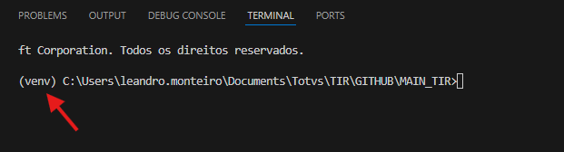

# TIR - Test Interface Robot


TIR is a Python module used to create test scripts for web interfaces. With it, you can easily create and execute test suites and test cases for any supported web interface systems, such as Protheus Webapp.

### Current Supported Technologies

- Protheus Webapp
- APW

## Table of Contents

[Documentation](#documentation)<br>
[Installation](#installation)<br>
[Config](#config)<br>
[Usage](#usage)<br>
[Docker](#docker)<br>
[Samples](#samples)<br>
[Contact Us](#contact)<br>
[Contributing](#contributing)

## Documentation
Our documentation can be found here:

- [TIR Documentation](https://totvs.github.io/tir-docs/)

- [TIR Technical Documentation](https://totvs.github.io/tir/)

This project has a docs folder with [Sphinx](http://www.sphinx-doc.org/en/master/) files.

Our **create_docs.cmd** script handles the installation of dependencies and creates the offline documentation on the doc_files/build/html folder.

## Installation

The installation is pretty simple. All you need as a requirement is Python 3.12 (Mozilla Firefox) installed in your system.

There are three ways of installing TIR:

### 1. Installing and Upgrade from PyPI

TIR can be installed via pip from [Pypi](https://pypi.org/project/tir-framework/)

```shell
pip install tir_framework --upgrade
```

### 2. via Terminal(Deprecated For The Branch Master)

You can install TIR via the terminal. Make sure your Python and Git are installed and run this command:

```shell
pip install git+https://github.com/totvs/tir.git --upgrade
```

It will install the last release of TIR in the active Python instance.

## Config

The environment must be configured through a [config.json](config.json) file.
You can find one to be used as a base in this repository. To select your file,
you can either put it in your workspace or pass its path as a parameter of any of our classes' initialization.

### Config options

Here you can find all the supported keys: [Config.json keys](https://totvs.github.io/tir/configjson)

### Custom config path

Just pass the path as a parameter in your script:

#### Protheus WebApp Class example:
```python
#To use a custom path for your config.json
test_helper = Webapp("C:\PATH_HERE\config.json")
```

## Usage

After the module is installed, you could just import it into your Test Case.
See the following example:

[**Protheus WebApp Class**](https://totvs.github.io/tir-docs/TIR/first/)


## Samples

We have a repository with different samples of TIR scripts:

[TIR Script Samples](https://github.com/totvs/tir-script-samples)


# Utilizando TIR com ambiente virtual 

## Conhecendo o conceito
Para execução do TIR em ambiente virtual, utilizaremos a biblioteca **Virtualenv**. Essa é uma ferramenta usada em Python para criar ambientes **isolados**. Cada ambiente virtual tem seus próprios diretórios de instalação de pacotes, separados do ambiente **global** do sistema. Isso é útil para gerenciar dependências de **diferentes** projetos/versões sem conflito.

## Configurando com VScode
### Instalando a biblioteca e Criando o ambiente

1. **Abra o terminal** (Prompt de Comando ou terminal do VS Code).
2. **Instale o Virtualenv** com o seguinte comando:

3.  **Crie o ambiente virtual** no diretório atual:
```bash

python -m virtualenv venv

```
>  **Observação:**
> Se você tiver mais de uma versão do Python instalada, pode ser necessário especificar o caminho do executável desejado.
> Exemplo:
>
> ```bash
>  "C:/caminho/python/pythonXY/python.exe" -m pip install virtualenv
>  "C:/caminho/python/pythonXY/python.exe" -m virtualenv venv
> ```
>
> Por padrão, o Python costuma ser instalado em:
>  `C:\Users\[seu_usuario]\AppData\Local\Programs\Python\Python[versão]`
4. Após executar o comando, uma pasta chamada `venv` será criada no diretório atual.

Esse é o seu ambiente virtual, pronto para uso!

### Configurando o Vscode 
Após a configuração do ambiente virtual iremos definir o interpretador do VScode para utiliza-lo
1. Com o VScode aberto na pasta do projeto, pressione `Ctrl + Shift + P` e pesquise pela opção `>Python: Select Interpreter`

2. Na lista de interpretadores reconhecidos no sistema, selecione o interpretador anteriormente criado, caminho padrão é:  **_./venv/Scripts/python.exe_** . Ao selecionar, o interpretador padrao utilizado se tornara esse, caso deseje utilizar outro é só seleciona-lo na lista.

3. Abra um novo terminal no Vscode indo em _"Terminal"_ e _"Novo terminal"_

4. Ao abrir o terminal veja se está inicializada a venv na linha de comando. 

5. Agora rode o comando para instalação do TIR! `pip install tir_framework --no-cache-dir --force-reinstall --upgrade`

7. Pronto! Agora seu tir esta pronto para executar em um ambiente isolado!.


## Contact

[Gitter](https://gitter.im/totvs-tir/General)

## Contributing

To contribute be sure to follow the [Contribution](CONTRIBUTING.md) guidelines.

Also, it's important to understand the chosen [architecture](https://github.com/totvs/tir/blob/master/doc_files/ARCHITECTURE.md).
