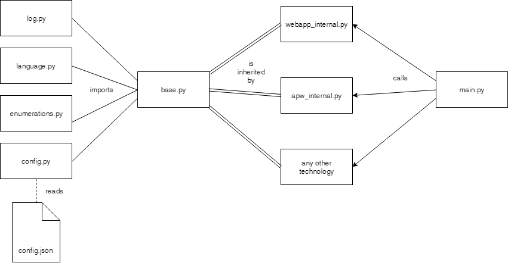

# TIR Architecture

This tool was idealized to work with any type of TOTVS Web technology.

To achieve this, the whole project is built in this particular architecture:



## The core

The core classes are the main part of the TIR tool.

The **base.py** contains the methods that are shared among all
technologies. It is this class that implements the communication with the browser and each other core classes to make sure that its functionalities are working properly.

The core classes

- **config.py** : A class that parses the *config.json* file;
- **enumerations.py** : contains each enumeration used in the tool;
- **language.py** : contains the language dictionaries;
- **log.py** : implements the log functionality;

## The implementation for each technology

Each technology should inherit the **base.py** class. It already handles the basic functionalities so now the only thing left is to create all methods that are specific to each technology.

e.g. A method for choosing an option from the menu could be different for each TOTVS technology.

This class must have the **internal** suffix after its name. At this point not all methods are designed for the user, so now we must define the user classes.

## The user classes

These classes are defined inside the **main.py** file and will simply invoke the calls for the internal classes.

The code below shows us the naming conventions and the general idea of the **main.py** file.

```python
from tir.technologies.technology_internal import TechnologyInternal

class Technology():
    def __init__(self, config_path=""):
        self.__technology = TechnologyInternal()

    def Method1(param1, param2):
        self.__technology.Method1(param1, param2)
```

The internal class is imported and instantiated in a private variable (notice the two dashes at the start of the variable).
After that, the methods are defined to invoke the methods from the internal class.

The idea is to have a separate class with its own documentation and only the methods the user should have access.

## Docstrings

All methods must be documented using docstrings.
Our documentation is auto generated using Sphinx, a tool that
reads these docstrings and creates a documentation website.

This is the pattern we are currently using:

```python
def sum_numbers(self, first_number, second_number = 0):
    '''
    This method returns the sum of two numbers.

    :param first_number: The First number to be added.
    :type first_number: int
    :param second_number: The Second number to be added. - **Default:** 0
    :type second_number: int

    :return: The sum of the first_number and the second_number.
    :rtype: int

    Usage:

    >>> self.sum_numbers(1,2)
    '''
    return first_number + second_number
```
